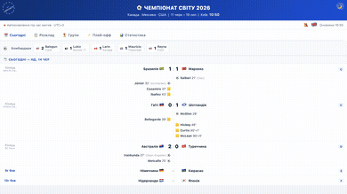
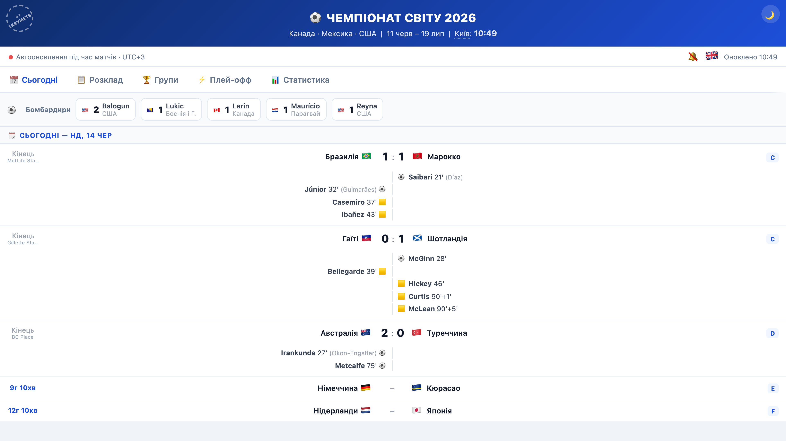
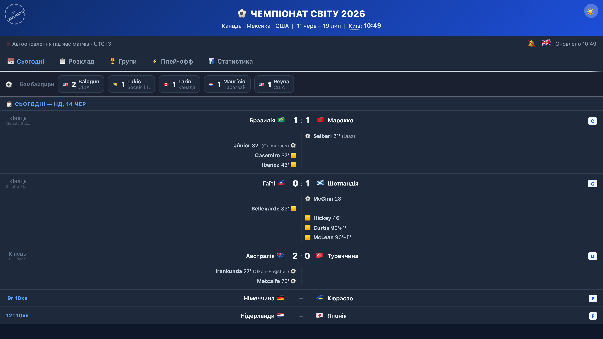
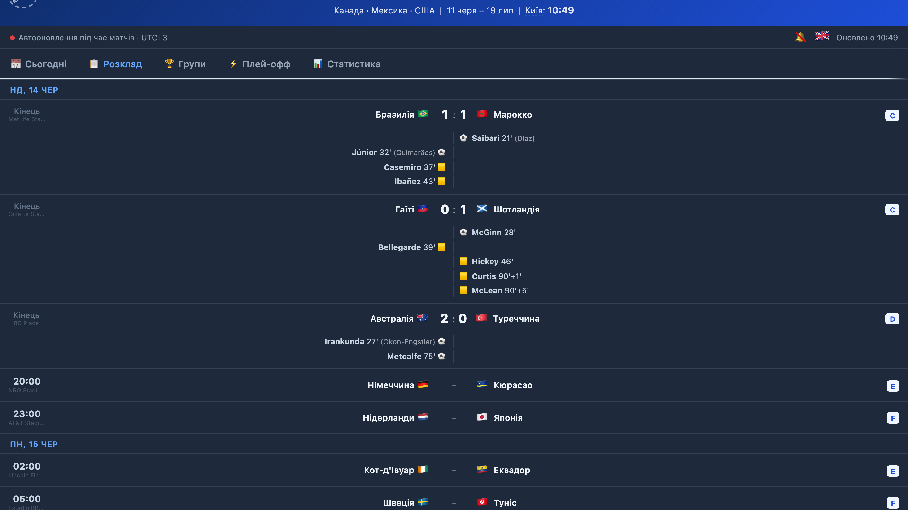
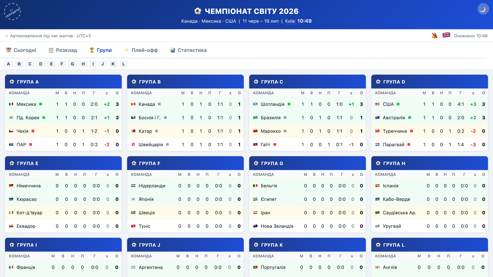
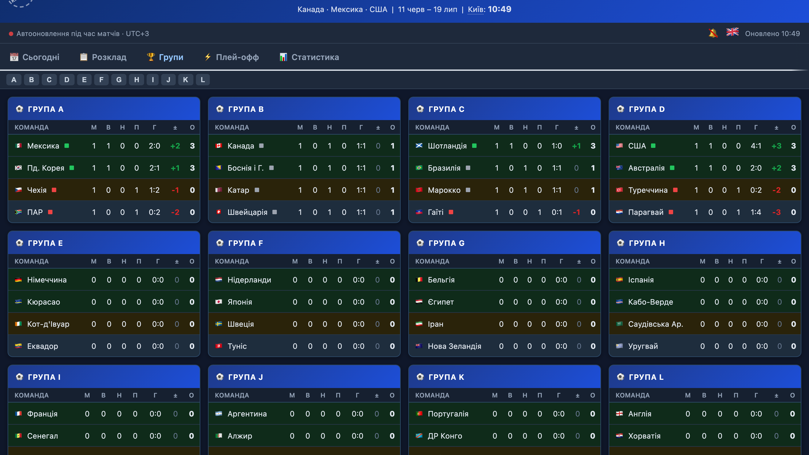
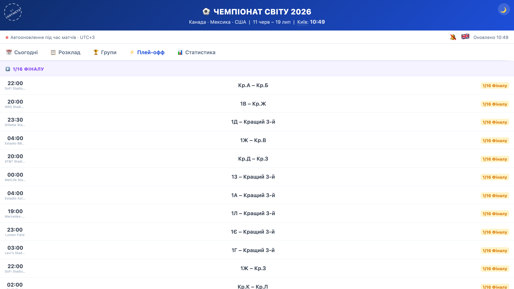
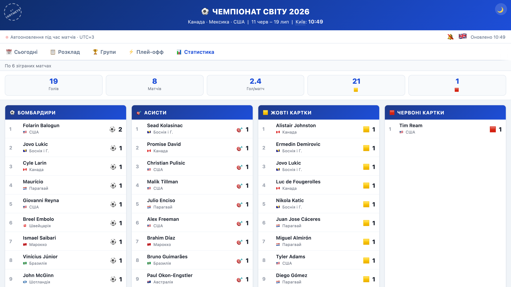

# ⚽ FIFA World Cup 2026 — Live Match Tracker

> A mobile-first live tracker for the 2026 FIFA World Cup. Auto-updating scores, goals, cards, player stats, group tables, and the full knockout bracket — all in a single HTML file with zero dependencies.

**Live site:** [krymets.github.io/wc2026](https://krymets.github.io/wc2026/)

---

## 🎬 Demo

## 📸 Screenshots

| Today (light) | Today (dark) | Schedule |
|:---:|:---:|:---:|
|  |  |  |

| Groups (light) | Groups (dark) | Knockout | Stats |
|:---:|:---:|:---:|:---:|
|  |  |  |  |

---

## Features

- **Today** — current day's matches with goals and cards by minute, plus a countdown to upcoming kick-offs
- **Schedule** — full list of all 104 matches with inline events (goals, assists, cards)
- **Groups** — live standings for all 12 groups: points, goal difference, form dots, qualification zones
- **Knockout** — bracket from Round of 32 through the Final
- **Stats** — top scorers, assists, yellow/red cards, goals-by-minute chart, clean sheets
- **Live scores** — auto-refresh every minute via ESPN API
- **Timezone switcher** — click the city name in the header to cycle through Kyiv, Warsaw, London, UTC, New York, Los Angeles, Vancouver
- **Language switch** — 🇬🇧 / 🇺🇦 toggle in the status bar
- **Dark mode** — toggle button in the header, preference saved to `localStorage`
- **Favorite team** — tap any team flag to filter; star it to pin to the Today view
- **Push notifications** — browser notifications for goal alerts
- **Firebase sync** — scores and events are synced across sessions via Firebase Realtime Database

## Tech

- Pure HTML + CSS + Vanilla JS — no frameworks, no build step, no dependencies
- Single `index.html`, ready to host anywhere (GitHub Pages, Netlify, etc.)
- ESPN Scoreboard API for live scores and match events
- `localStorage` + Firebase Realtime Database for cross-session caching

## Tournament

| | |
|---|---|
| Hosts | Canada · Mexico · USA |
| Group stage | 11 Jun – 28 Jun 2026 |
| Knockout stage | 28 Jun – 19 Jul 2026 |
| Final | 19 Jul 2026, MetLife Stadium |
| Teams | 48 (12 groups of 4) |
| Matches | 104 |

---
---

# ⚽ Чемпіонат Світу 2026 — Живий трекер матчів

> Мобільний живий трекер ЧС-2026. Автооновлення рахунків, голи, картки, статистика гравців, таблиці груп і сітка плей-офф — усе в одному HTML-файлі без жодних залежностей.

**Сайт:** [krymets.github.io/wc2026](https://krymets.github.io/wc2026/)

---

## 🎬 Демо

## 📸 Скріншоти

| Сьогодні (світла) | Сьогодні (темна) | Розклад |
|:---:|:---:|:---:|
|  |  |  |

| Групи (світла) | Групи (темна) | Плей-офф | Статистика |
|:---:|:---:|:---:|:---:|
|  |  |  |  |

---

## Що вміє

- **Сьогодні** — матчі поточного дня з голами і картками по хвилинах + зворотний відлік до наступних матчів
- **Розклад** — повний список усіх 104 матчів з подіями кожного матчу (голи, асисти, картки)
- **Групи** — живі таблиці 12 груп з очками, різницею голів, формою та зонами виходу
- **Плей-офф** — сітка від 1/32 фіналу до фіналу
- **Статистика** — бомбардири, асисти, жовті/червоні картки, розподіл голів по хвилинах, матчі без пропущених
- **Live-рахунки** — автооновлення кожну хвилину через ESPN API
- **Зміна часового поясу** — натисніть на назву міста в шапці, щоб перемикати між Київ, Варшава, Лондон, UTC, Нью-Йорк, Лос-Анджелес, Ванкувер
- **Перемикач мови** — 🇬🇧 / 🇺🇦 кнопка в статус-барі
- **Темна тема** — кнопка в шапці, налаштування зберігається в `localStorage`
- **Улюблена команда** — тап по прапорцю команди фільтрує матчі; зірочка закріплює на вкладці «Сьогодні»
- **Push-сповіщення** — браузерні повідомлення про голи
- **Firebase синхронізація** — рахунки та події синхронізуються між сесіями через Firebase Realtime Database

## Технології

- Чистий HTML + CSS + Vanilla JS — без фреймворків, без збірки, без залежностей
- Один файл `index.html`, готовий до хостингу де завгодно (GitHub Pages, Netlify тощо)
- ESPN Scoreboard API для live-рахунків та подій матчів
- `localStorage` + Firebase Realtime Database для кешування між сесіями

## Турнір

| | |
|---|---|
| Країни-господарі | Канада · Мексика · США |
| Групова стадія | 11 черв – 28 черв 2026 |
| Плей-офф | 28 черв – 19 лип 2026 |
| Фінал | 19 липня 2026, MetLife Stadium |
| Команд | 48 (12 груп по 4) |
| Матчів | 104 |

---

## Ліцензія

[MIT](LICENSE)